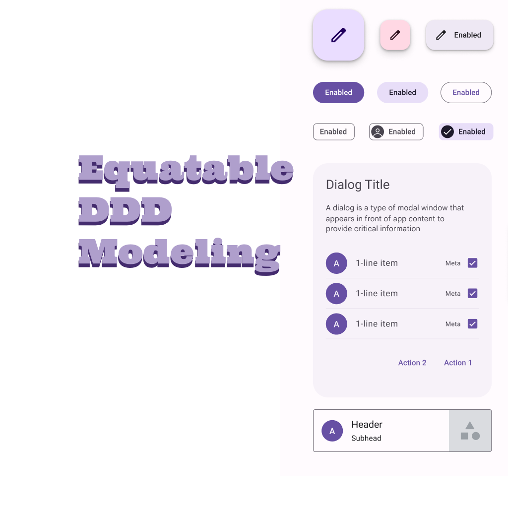

# equatable_ddd_modeling

A Flutter demo project to show how to use Equatable value objects as the glue between interfaces and implementation in the domain layer.

## Medium Article

You can find the medium article with this friends free link:

[Medium Article}()

And you should sign up for my Email newsletter at my medium blog:

[Fred Grott's Medium Blog](https://fredgrott.medium.com)

## About Fred Grott

Hi there, this is Fred Grott. I recently re-booted my life by getting control of my ADHD through such things as creating a note taking system using VSCode and ZettleKatsen note taking systems. 

My goal here is to bootstrap myself into mastering Flutter app development while at the same time teach you the expert fltter best practices that are not in the flutter docs.

Lets make Flutter Apps Awesome!

You can follow me on:

[Fred Grott at keyBase](https://keybase.io/fredgrott)

[Fred Grott at Twitter](https://twitter.com/fredgrott)

[Fred Grott at GitHub](https://github.com/fredgrott)

